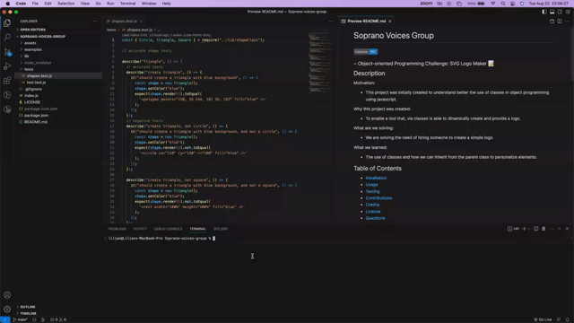

# Soprano Voices Group

### ~ Object-oriented Programming Challenge: SVG Logo Maker 📝

## Description

Motivation:

- This project was initially created to understand better the use of classes in object programming using javascript.

Why this project was created:

- To enable a tool that, via classes is able to dinamically create and provide a logo.

What are we solving:

- We are solving the need of hiring someone to create a simple logo.

What we learned:

- The use of classes and how we can inherit from the parent class to personalize elements.

## Table of Contents

- [Installation](#installation)
- [Usage](#usage)
- [Testing](#testing)
- [Contributions](#contributing)
- [Credits](#credits)
- [License](#license)
- [Questions](#questions)

## Installation

To run the project in your local machine:

1. Open visual studio in your computer or laptop
2. Clone the git project: https://github.com/lilianpatinoortiz/Soprano-voices-group
3. Pull the latest from the 'main' branch
4. Open a new terminal and type `npm install` to install the dependencies
5. Locate the index file and locate yourself there
6. Open a new terminal and type `node index`

Here is an example of how the project should work:

Video of the screen can be found in this link:
https://drive.google.com/file/d/178KTLH6Lr6KyAaX69bkD0k-pvgu4GjwU/view?usp=sharing

A visual representation of the creating svg video:

## Usage

After running the project you will be able to access the svg generator tool. Enter the 3 characters that you want to have in your logo, enter the color of the text, select your shape and enter the color of the shape.

Once all is filled your new logo will be saved in the examples folder under the name 'logo.svg' ready to be used in your sites!

## Testing

1. Open visual studio in your computer or laptop
2. Clone the git project: https://github.com/lilianpatinoortiz/Soprano-voices-group
3. Pull the latest from the 'main' branch
4. Open a new terminal and type `npm install` to install the dependencies
5. Locate the index file and locate yourself there
6. Open a new terminal and type `npm test`

A visual representation of the testing video:

## Contributing

If you want to contribute on this project please contact me directly via email lilly.0608@gmail.com. Happy coding!

## Credits

The main resources used:

- Module 10 information provided in canva

## License

Please refer to the license badge, on top of this file.

## Questions

Any question, please feel free to contact me directly via email lilly.0608@gmail.com or via https://github.com/lilianpatinoortiz
